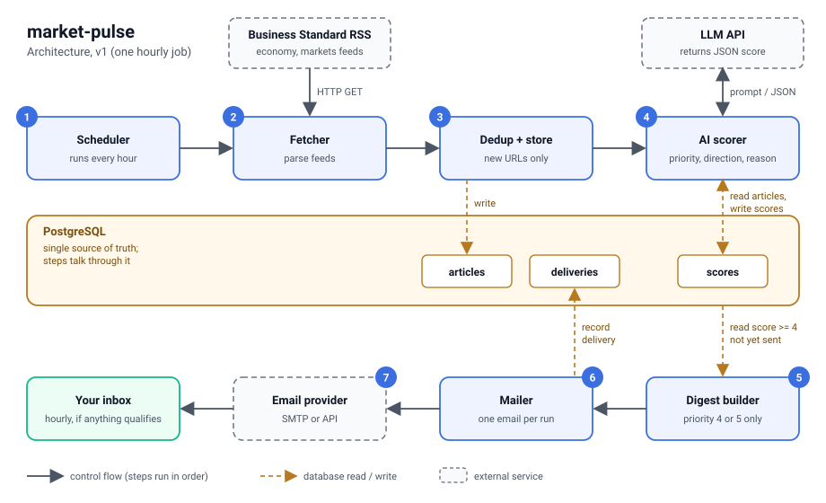
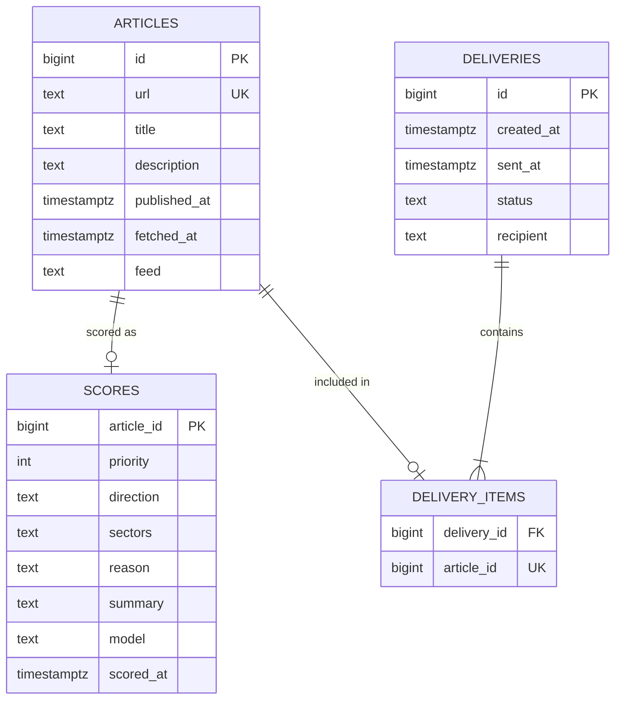

# market-pulse: Architecture

Status: design draft for v1 (5 Oct 2026). No code yet.

market-pulse watches Business Standard for Indian economy and market news that is likely to move the Sensex or Nifty, scores each new article with an LLM, and emails a short digest every hour, but only when something is high priority.



## Goals and non-goals

**Goals**

- Surface market-moving Indian news (trade deals, RBI policy, Budget, inflation and GDP data, SEBI and regulatory moves) without watching feeds all day.
- Send at most one email per hour, and none when nothing qualifies.
- Keep v1 small enough to build and run alone.

**Non-goals for v1**

- Other news sources, global news, or per-company alerts.
- A web UI, user accounts or multiple recipients.
- Trading signals. The output is information only, not investment advice.

## How a run works

The job runs once an hour and executes these steps in order. The steps do not call each other's internals; they hand work over through PostgreSQL.

1. **Scheduler** starts the job.
2. **Fetcher** downloads the configured RSS feeds and parses the items.
3. **Dedup + store** normalises each article URL and inserts only the ones not seen before.
4. **AI scorer** reads articles that have no score yet, asks the LLM for a structured score, and saves it.
5. **Digest builder** selects articles with priority 4 or 5 that have not been emailed.
6. **Mailer** records the delivery, then sends one email containing all of them.
7. **Email provider** delivers it to your inbox.

If step 5 finds nothing, no email is sent.

## Components

| Component | Responsibility | Notes |
|---|---|---|
| Scheduler | Triggers a run every hour | Hosting not decided; see open questions |
| Fetcher | Reads RSS, returns title, link, published time, description | One HTTP GET per feed |
| Dedup + store | Normalises URLs, inserts new articles | Unique constraint on `url` is the real guard |
| AI scorer | Calls the LLM, validates the JSON, stores the score | Only scores new articles, capped per run |
| Digest builder | Chooses what goes in this hour's email | Priority at or above the threshold, not yet delivered |
| Mailer | Records the delivery, sends the email, updates status | Plain text plus simple HTML |
| PostgreSQL | Articles, scores, deliveries | Single source of truth |

## Data sources

Business Standard publishes official RSS feeds. These were listed on its RSS page on 5 Oct 2026. I have not yet confirmed that each one returns fresh items.

| Feed | URL |
|---|---|
| Economy | `https://www.business-standard.com/rss/economy-102.rss` |
| Markets | `https://www.business-standard.com/rss/markets-106.rss` |
| Stock market news | `https://www.business-standard.com/rss/markets/stock-market-news-10618.rss` |
| Finance | `https://www.business-standard.com/rss/finance-103.rss` |
| Top stories | `https://www.business-standard.com/rss/home_page_top_stories.rss` |
| Latest | `https://www.business-standard.com/rss/latest.rss` |

Suggested starting set: Economy, Markets and Top stories.

The site's `robots.txt` does not restrict the economy, markets or RSS paths. The RSS page states no reuse terms, so read the site's terms and conditions before relying on it. To keep the footprint small, store only the headline, link, publish time and your own AI summary, never the full article text, and link back to the original in the email.

### URL normalisation

The same article can appear under several URLs, for example an AMP version. Before the duplicate check:

1. Lowercase the host.
2. Remove a leading `/amp` path segment.
3. Drop the query string and fragment.
4. Remove any trailing slash.

Example:

```text
https://www.business-standard.com/amp/economy/news/india-us-have-reached-a-plateau-in-trade-talks-says-fm-nirmala-sitharaman-126100500184_1.html
-> https://www.business-standard.com/economy/news/india-us-have-reached-a-plateau-in-trade-talks-says-fm-nirmala-sitharaman-126100500184_1.html
```

## Data model



Notes:

- `articles.url` is unique, so a second insert of the same story does nothing.
- `delivery_items.article_id` is unique, so an article can appear in at most one email.
- `scores.sectors` can be a Postgres `text[]` column; it is shown as `text` here because the diagram syntax has no array type.
- `deliveries.status` is one of `pending`, `sent`, `failed`.

## Scoring contract

The scorer asks the LLM for strict JSON and rejects anything that does not match.

| Field | Type | Meaning |
|---|---|---|
| `priority` | integer 1 to 5 | Likely impact on the Indian market |
| `direction` | `positive`, `negative`, `neutral`, `unclear` | Expected effect on sentiment |
| `sectors` | list of strings | Sectors most affected, empty if broad |
| `reason` | string | One sentence on why it matters |
| `summary` | string | One or two sentence summary in the model's own words |

| Priority | Meaning | Example |
|---|---|---|
| 5 | Likely to move the whole market today | Surprise RBI rate decision |
| 4 | Material, broad impact | Stalled trade talks with a major partner |
| 3 | Relevant to some sectors | A sector-specific policy change |
| 2 | Background or commentary | Analyst views on the economy |
| 1 | Not market relevant | Lifestyle or general news |

Priority 4 and 5 trigger the email. The threshold is configurable.

Illustrative output for the India-US trade talks story (not a measured result):

```json
{
  "priority": 4,
  "direction": "negative",
  "sectors": ["exporters"],
  "reason": "Trade talks with the US have stalled, which raises tariff uncertainty.",
  "summary": "The finance minister said further concessions would be very difficult, and the US trade representative said a deal is not imminent."
}
```

The prompt needs testing against real articles before the threshold is trusted.

## Reliability decisions

| Situation | Behaviour |
|---|---|
| A feed is down or returns garbage | Log it and continue with the other feeds |
| The LLM call fails or returns invalid JSON | The article stays unscored and is retried next run |
| Too many new articles in one run | Score up to a fixed cap; the rest wait for the next run |
| The same story arrives twice | The unique `url` constraint drops it |
| Email sending fails | Mark the delivery `failed` and release its articles so the next run can include them |
| The job crashes after sending but before marking `sent` | The delivery stays `pending` and its articles are not re-sent, so a duplicate email is avoided at the cost of possibly missing a retry; log stale `pending` rows for review |

Sending order matters: write the `pending` delivery and its items in one transaction first, then send, then mark `sent`.

## Configuration

Proposed environment variables:

| Variable | Purpose | Default |
|---|---|---|
| `DATABASE_URL` | Postgres connection string | none |
| `FEED_URLS` | Comma-separated feed list | Economy, Markets, Top stories |
| `LLM_API_KEY` | Key for the scoring model | none |
| `LLM_MODEL` | Model used for scoring | choose a small, cheap model |
| `PRIORITY_THRESHOLD` | Minimum priority to email | `4` |
| `MAX_SCORED_PER_RUN` | Cap on LLM calls per run | `30` |
| `EMAIL_TO` | Your address | none |
| `EMAIL_PROVIDER_*` | SMTP or API credentials | none |
| `DRY_RUN` | Print the email instead of sending | `false` |

Keep secrets out of the repository. Commit a `.env.example` with placeholder values only.

## Open questions

- Where does the hourly job run? Options include a scheduled GitHub Actions workflow, a small VM with cron, or a container job on a cloud provider.
- Where does Postgres live? A local container for development; a free-tier hosted instance if the job runs in the cloud.
- Which email provider? Any SMTP account or a transactional email API would work.
- Which model and what does an hour of scoring cost? Measure after the first real run.
- Is feed reuse acceptable under Business Standard's terms for this personal use?

## Possible later versions

Not committed, listed in the order they would probably be tackled.

1. **UI**: a small React app with a GraphQL API to change the threshold, view alert history, and mark alerts useful or not.
2. **Events**: move the hand-offs from the database to a message broker such as RabbitMQ, with an outbox table so a database write and its event never disagree.
3. **Observability**: metrics for articles fetched, alerts sent, scoring latency and cost, shown in Grafana.
4. **Validation**: record Sensex and Nifty levels at publish time and one to two hours later, to measure whether high-priority alerts really preceded moves.
5. **More sources**: additional Indian outlets, with story grouping so one event produces one alert.

## Disclaimer

market-pulse provides news summaries for information only. It is not investment advice, and its priority scores are model output that may be wrong.
